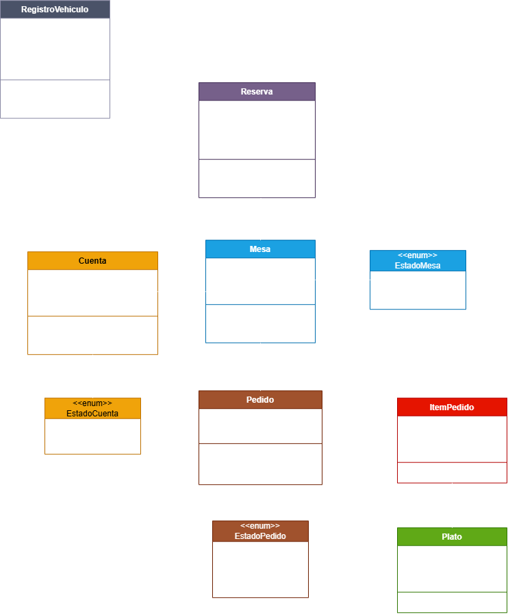
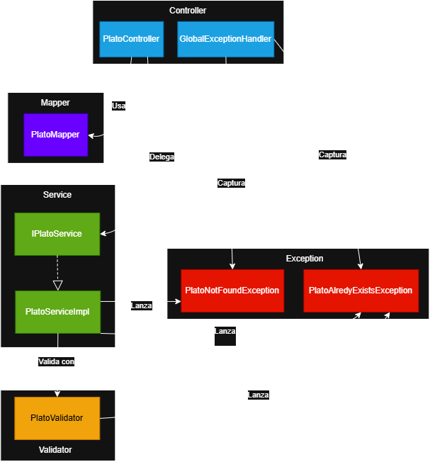

# Bitácora Corte 2 — API Restaurante

## Diagramas

### 1. Diagrama de Clases (Dominio)

**Descripción:** Muestra las entidades puras del dominio del restaurante con sus
atributos y métodos de negocio. No incluye DTOs ni componentes de infraestructura.

### 2. Diagrama de Componentes (Arquitectura interna)

**Descripción:** Muestra la arquitectura del backend siguiendo el patrón
Controller -> Service -> Validator -> Mapper.

### 3. Diagrama de Secuencia (Crear un plato)

**Descripción:** Muestra el flujo del caso de uso "Crear un plato",
incluyendo validaciones de input, reglas de negocio y manejo de errores.